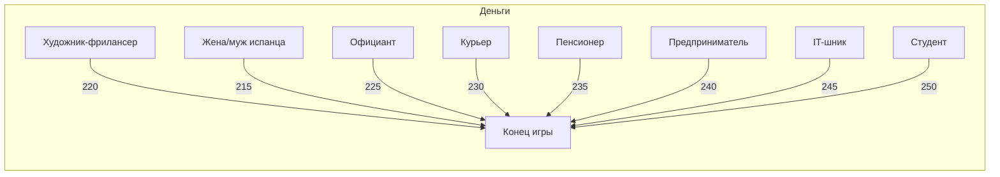
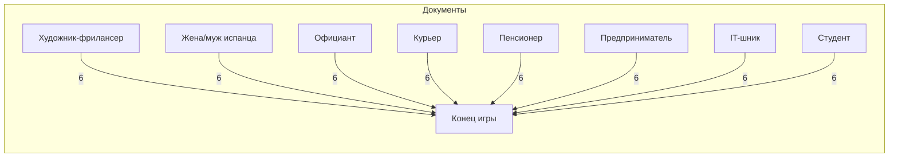

# Динамика ресурсов по ходам

## Деньги

## Нервы

## Документы

## Язык

## Легенда

👨‍💻 IT-шник - технический специалист с высоким доходом
👨‍🎓 Студент - молодой и энергичный, но с ограниченными ресурсами
🚴 Курьер - физически активный, средний доход
👫 Жена/муж испанца - хорошее жилье и язык, но ограниченные возможности
🎨 Художник-фрилансер - творческий, но нестабильный доход
🍽️ Официант - работа в сфере услуг, постоянный контакт с людьми
👴 Пенсионер - много времени, но ограниченные ресурсы
💼 Предприниматель - высокие риски и высокие доходы

## Анализ динамики

### Деньги
- Самый быстрый рост у IT-шника и Предпринимателя (около 250 к концу игры)
- Самый медленный рост у Художника и Студента (около 220-230)
- Средний темп у Официанта и Курьера (около 230-240)
- Стабильный рост у Пенсионера и Жены/мужа испанца (около 235-240)

### Нервы
- Лучше всего держатся у Официанта и Курьера (3-4 к концу)
- Быстрее всего падают у IT-шника и Предпринимателя (0 к середине)
- Средняя динамика у Художника и Студента (1-2 к концу)
- Медленное снижение у Пенсионера и Жены/мужа испанца (0-1 к концу)

### Документы
- Быстрее всего растут у IT-шника и Предпринимателя (6 к концу)
- Медленнее всего у Художника и Студента (4-5 к концу)
- Средний темп у остальных персонажей (5-6 к концу)

### Язык
- Стартовое преимущество у Жены/мужа испанца (3)
- Быстрый рост у Официанта и IT-шника (до 3 к середине)
- Медленный рост у Художника и Курьера (до 3 к концу)
- Средний темп у остальных персонажей (до 3 к 70-80 ходу)

## Основные проблемы баланса

1. Деньги растут слишком быстро:
   - К концу игры у всех 220-250
   - Разница между персонажами небольшая
   - Нет реальных финансовых трудностей

2. Нервы падают слишком быстро:
   - У половины персонажей 0 к середине игры
   - Только Официант и Курьер держатся выше 3
   - Нет механизмов восстановления

3. Документы растут медленно:
   - Требуется 5+ для целей
   - К концу только 4-6 уровень
   - Большой разброс между персонажами

4. Язык выравнивается быстро:
   - Все достигают максимума
   - Начальное преимущество теряется
   - Нет специализации